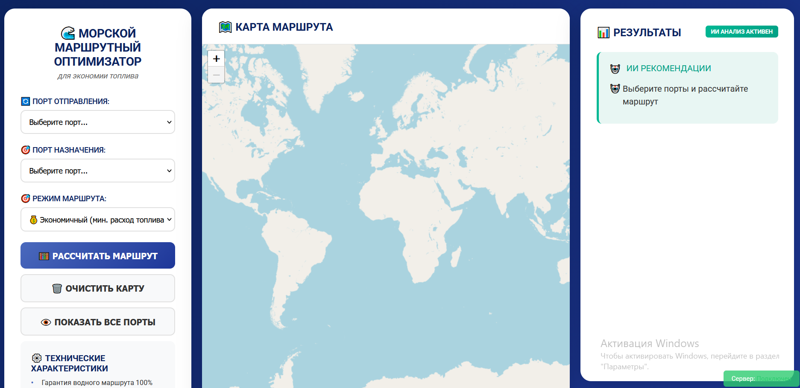
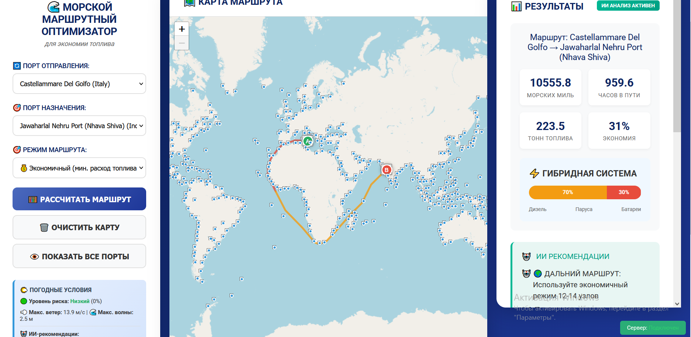
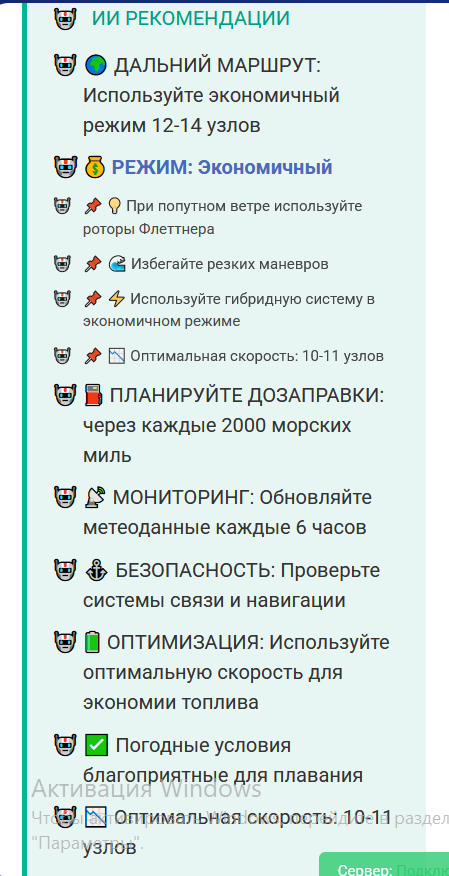

# 🚢 Оптимизация морских маршрутов

Веб-приложение для расчёта и визуализации оптимальных морских маршрутов с учётом
метеоусловий и гибридных силовых установок. Дипломный проект (СПбГМТУ, 2026).

Имитационные испытания показали снижение расхода топлива **до 31%** относительно
базовых (ортодромических) маршрутов.

## ✨ Возможности

- Построение маршрута между портами на интерактивной карте (Leaflet.js)
- Три режима расчёта энергозатрат: **дизель**, **электротяга**, **парус**
- Интеграция с OpenWeatherMap API: учёт ветра при расчёте расхода топлива
- ИИ-рекомендации по выбору режима движения на каждом участке пути
- Клиент-серверная архитектура, REST API (JSON)

## 🛠 Стек

- **Backend:** Python 3.14, Flask, Flask-CORS
- **Frontend:** HTML5, CSS3, JavaScript, Leaflet.js
- **Данные:** CSV (порты), GeoJSON (океанические зоны), JSON (обмен данными)

## 🚀 Запуск

### 1. Клонируйте репозиторий

```bash
git clone https://github.com/Seoxety/diploma-maritime-optimizer.git
cd diploma-maritime-optimizer
```

### 2. Установите зависимости

```bash
cd backend
pip install -r requirements.txt
```

### 3. Настройте окружение

```bash
cp .env.example .env
```

Откройте `.env` и вставьте свой ключ OpenWeatherMap вместо `your_api_key_here`
(бесплатный ключ: https://openweathermap.org/api).

### 4. Запустите сервер

```bash
python server.py
```

Приложение будет доступно по адресу `http://localhost:5000`.

&gt; Без API-ключа приложение работает в демо-режиме (метеоданные берутся из заглушки).

## 📁 Структура проекта

```
backend/
├── server.py            # Flask-сервер, REST API, алгоритм A*
├── route_modes.py       # Расчёт трёх режимов движения (дизель/электро/парус)
├── hybrid_system.py     # AI-модуль: генерация рекомендаций
├── weather_service.py   # Интеграция с OpenWeatherMap API
├── ports.csv            # База морских портов (~340 КБ)
├── ocean-grid-cache.json# Кэш навигационной сетки
├── requirements.txt
└── .env.example         # Шаблон конфигурации
frontend/
├── index.html
├── style.css
└── app.js               # Логика карты и взаимодействие с API
```

## 🔌 API

| Метод | Эндпоинт | Описание |
|-------|----------|----------|
| GET | `/api/ports` | Список портов (с фильтрацией по названию/стране) |
| POST | `/api/route` | Расчёт маршрута: координаты, метаданные расхода, ИИ-рекомендации |

## 📸 Скриншоты

### Главный интерфейс


### Построенный маршрут


### ИИ-рекомендации


## 📄 Документация

Подробное описание математической модели, архитектуры и результатов
испытаний — в пояснительной записке к дипломному проекту (118 с.):
[ссылка на PDF, когда выложите].

## 🔮 Планы развития

- Интеграция с бортовыми AIS-транспондерами
- Прогнозирование энергопотребления на нейросетевых моделях по историческим данным
